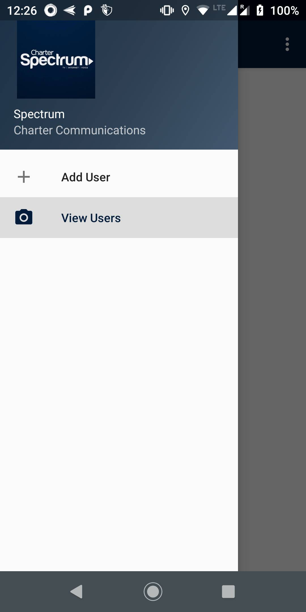
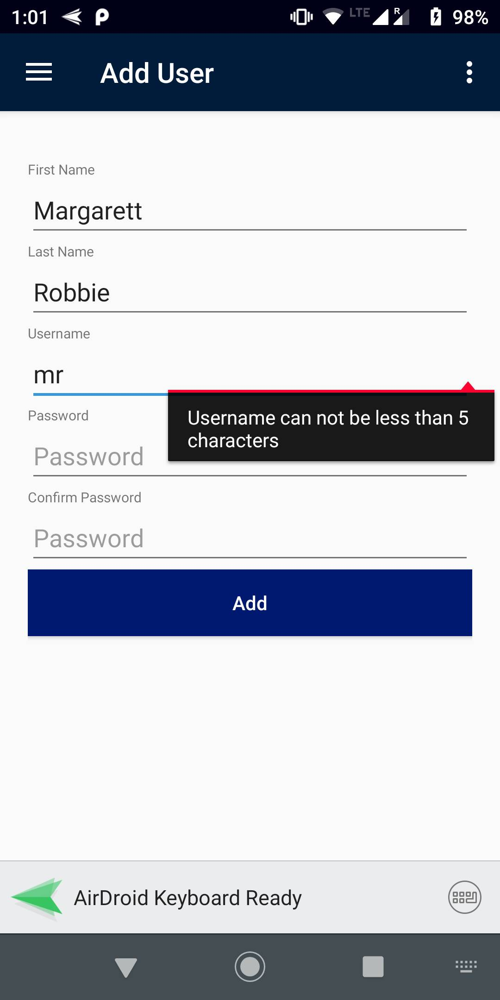
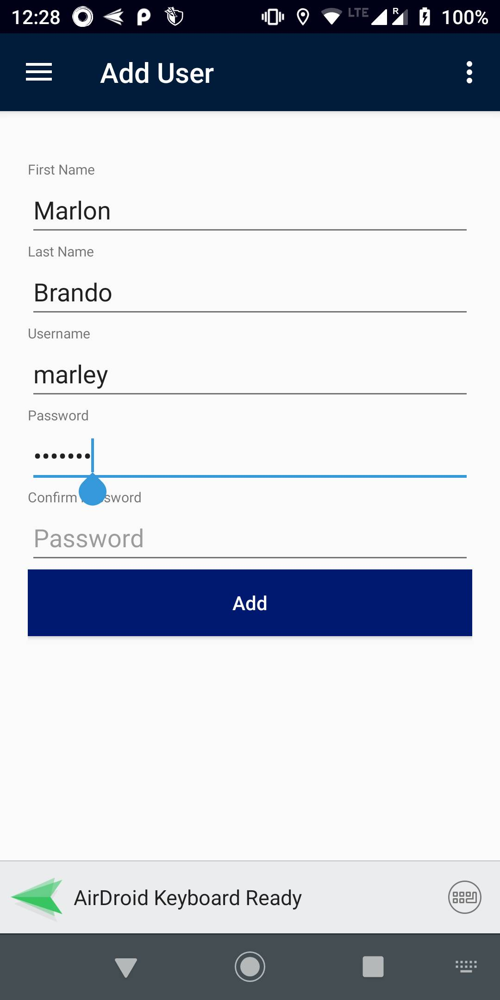
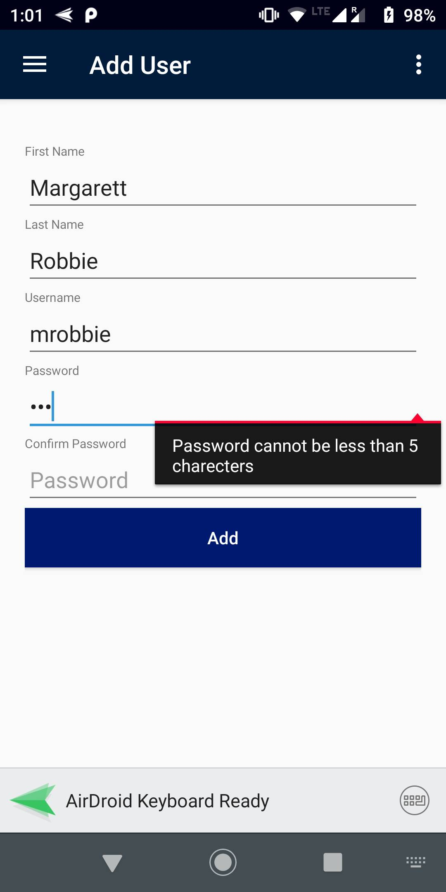
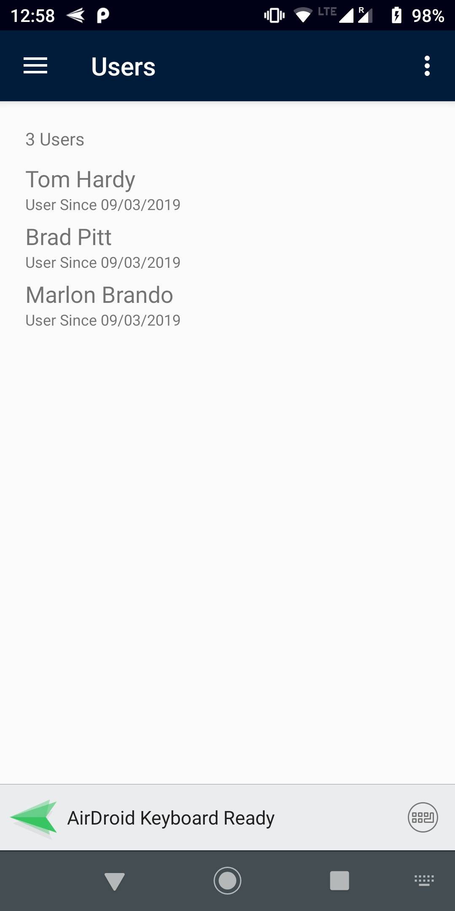
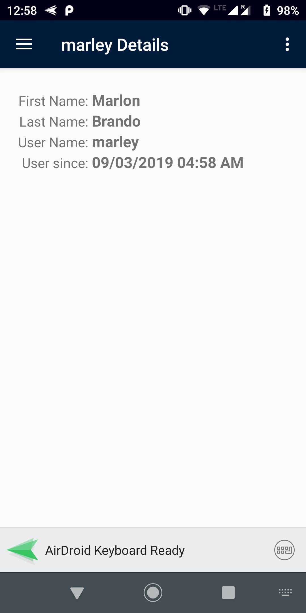
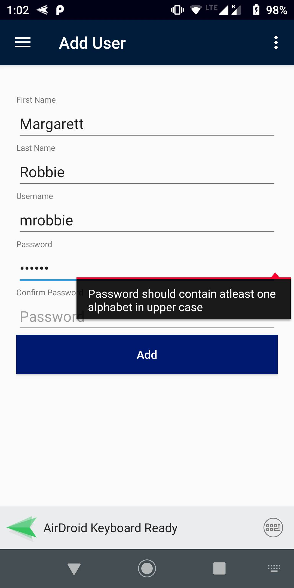
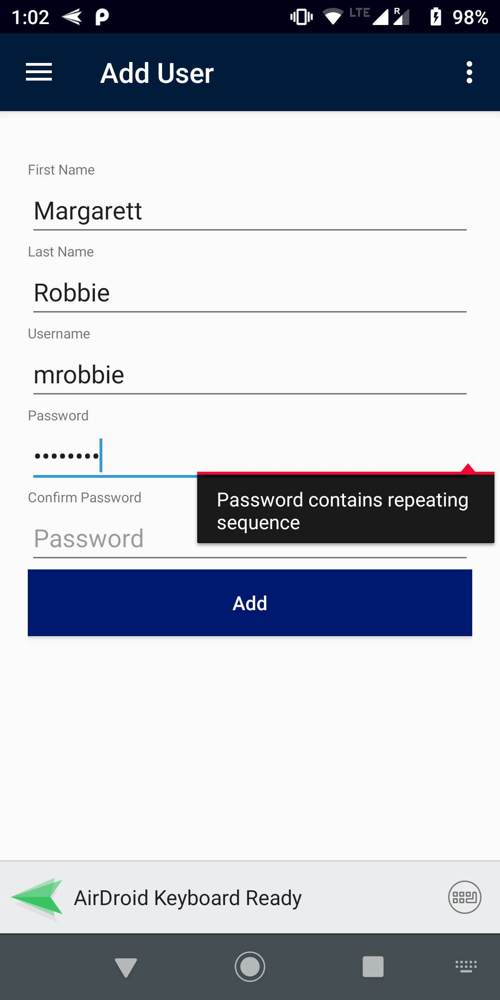

# Add-View users app

This is Xamarin.Android native app making use of Drawer layout with 2 menu options:

- Add User : Opens fragment to add a new user
- View Users : Opens fragment to view all registered users

## Database 

[Realm database](https://realm.io/docs) has been used for local storage

## Validations

- Username validation : Cannot be less than 5 characters  
- Password
  1. Can not be less than 5 characters
  2. Can not be more than 12 characters
  3. Should not contain repeating sequence
  4. Should contain at least 1 capital letter
  5. Should contain at least 1 small letter
- Confirm password : Should be same as password field  

## Links

- App screen walkthrough - [Youtube/ScreenWalkthrough](https://youtu.be/VRL4MDuDoXU)
- AppCenter integration walkthrough  [Youtube/AppCenterWalkthrough](https://youtu.be/kXK7ABYoVsI)

## Screenshots
  
  
  
  
  
  
  
  
												

